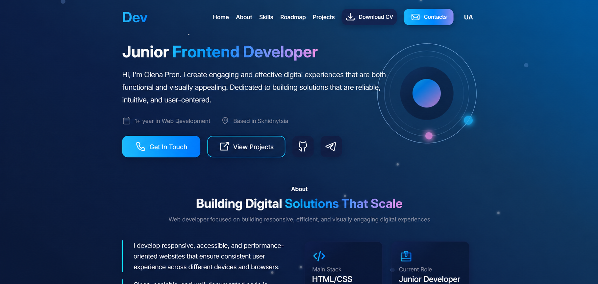

# Personal Portfolio Website

A modern and responsive personal portfolio website created to showcase my skills, projects, and experience as a Frontend Developer.



## Live Demo

🔗 https://hhxdz.github.io/My-Portfolio/

## Features

- Responsive design for all screen sizes
- Modern UI with gradients and animations
- Multilanguage support
    - [x] English
    - [x] Ukrainian
- About Me section
- Skills showcase
- Project gallery
- Experience roadmap
- Downloadable multilanguage CV
- Contact information and social links
- Smooth navigation between sections

## Built With
<table border="none">
  <tr>
    <td align="center">
      <br>
      HTML5
    </td>
    <td align="center">
      <br>
      CSS3
    </td>
    <td align="center">
      <br>
      JavaScript
    </td>
    <td align="center">
      <br>
      Git
    </td>
    <td align="center">
      <br>
      Figma
    </td>
  </tr>
</table>

## Getting Started

1. Clone the repository

```bash
git clone https://github.com/hhxdz/My-Portfolio.git
```

2. Open the project folder

```bash
cd My-Portfolio
```

3. Launch `index.html` in your browser or use Live Server.

## Contact

GitHub: https://github.com/hhxdz

Email: pronivanka16@gmail.com

Feel free to reach out for collaboration or feedback.
